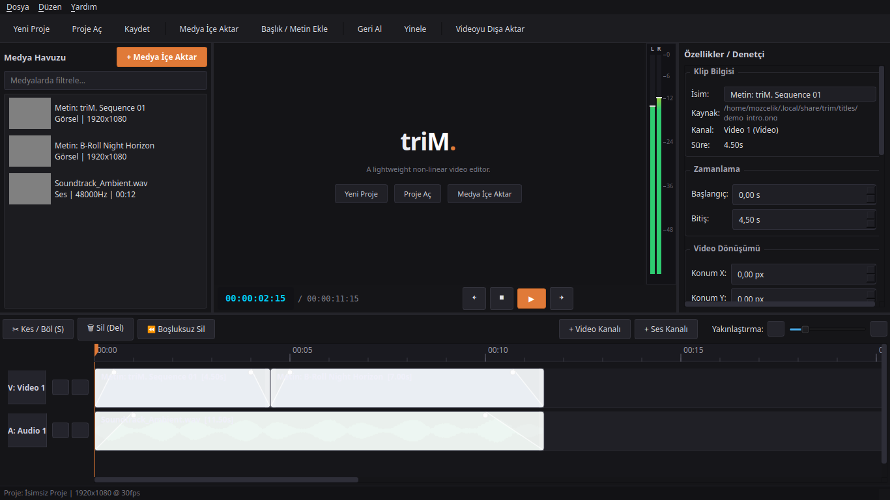

<p align="center">
  <a href="https://mozcelik14.github.io/triM/">
    
  </a>
</p>

<p align="center">
  A lightweight, native non-linear video editor for Linux.
</p>

<p align="center">
  <a href="LICENSE"></a>
  <a href="https://www.python.org/downloads/"></a>
  <a href="https://www.qt.io/"></a>
  <a href="https://github.com/MOzcelik14/triM/releases/tag/v0.1.0"></a>
  
</p>

<p align="center">
  <a href="#english"><strong>English</strong></a> &bull; <a href="#türkçe"><strong>Türkçe</strong></a> &bull; <a href="https://mozcelik14.github.io/triM/"><strong>Website</strong></a>
</p>

---

<a name="english"></a>
## English

**triM.** is a modern, fast, and native non-linear video editor (NLE) designed specifically for Linux desktop environments.

Built on Python 3.12, PySide6 (Qt6), FFmpeg, and PyAV, it provides a clean, precision-oriented workflow for video cutting, trimming, audio mixing, and exporting without cloud dependencies or Electron runtime overhead.

### Preview

<p align="center">
  
</p>

### Features

- **Multi-Track Timeline:** Independent video and audio tracks with split/razor cuts (`S`), ripple delete (`Shift+Delete`), frame-snapping, and drag-and-drop sequencing.
- **Hardware-Assisted Playback & Sync:** Sequential video demuxing and queued audio streaming via PyAV for smooth, stutter-free playback and frame-accurate real-time speed.
- **Waveform Visualizations:** Multi-threaded audio peak extraction with persistent caching directly rendered on timeline audio clips.
- **Interactive Fade Handles:** Clip-level draggable visual handles for video opacity curves and live audio gain ramps.
- **Dual-Channel Stereo VU Meter:** Real-time RMS dBFS monitoring with peak hold indicators aligned to the program monitor.
- **Shuttle Navigation:** Industry-standard J-K-L shuttle playback (`1x`, `2x`, `4x`, `8x`, `-1x`, `-2x`, `-4x`, `-8x`), single-frame stepping (`←` / `→`), and edit-point jumping (`↑` / `↓`).
- **Color Grading & Transitions:** Real-time brightness, contrast, and saturation adjustments (including instant black-and-white conversion) and smooth Dip to Black / Dip to White transitions.
- **Typography & Title Cards:** Native text generator with system font selection, lower-third presets, alignment controls, and alpha transparency.
- **FFmpeg Background Export:** Preset-driven resolution and framerate exports, multi-threaded filtergraph execution (`scale`, `pad`, `eq`, `fade`, `afade`), and progress tracking.
- **Crash Recovery & Autosave:** Periodic background snapshots and automatic session restoration on startup.

### Installation

#### Option 1: Debian / Ubuntu (.deb Package)

Download the prebuilt `.deb` package from the [v0.1.0 Release](https://github.com/MOzcelik14/triM/releases/tag/v0.1.0):

```bash
wget https://github.com/MOzcelik14/triM/releases/download/v0.1.0/trim_0.1.0_all.deb
sudo apt install ./trim_0.1.0_all.deb
```

Once installed, launch `triM.` from your desktop application launcher (under *Sound & Video*) or run:

```bash
trim
```

#### Option 2: Automated Desktop Setup Script (`install.sh`)

For any Linux distribution, clone the repository and run the setup script:

```bash
git clone https://github.com/MOzcelik14/triM.git
cd triM
./install.sh
```

This prepares the virtual environment, installs dependencies, registers desktop shortcuts (`io.github.mozcelik14.triM.desktop`), installs hicolor icons, and adds `~/.local/bin/trim` to your environment.

#### Option 3: Manual / Developer Setup

```bash
git clone https://github.com/MOzcelik14/triM.git
cd triM
python3 -m venv .venv
source .venv/bin/activate
pip install -r requirements.txt
pip install -e .
trim
```

Alternatively, use the convenience launcher:

```bash
./run.sh
```

### System Requirements

- **Operating System:** Linux (tested on Ubuntu 22.04+, Debian 12+, Fedora 39+, Arch Linux)
- **Display Server:** Wayland or X11
- **Python:** 3.12 or newer
- **FFmpeg:** `ffmpeg` and `ffprobe` binaries in `$PATH`

Package installation commands for FFmpeg:

```bash
# Ubuntu / Debian
sudo apt update && sudo apt install ffmpeg

# Fedora
sudo dnf install ffmpeg

# Arch Linux
sudo pacman -S ffmpeg
```

### Development

Run the test suite:

```bash
.venv/bin/pytest tests/ -v
```

Build the Debian package locally:

```bash
./scripts/build_deb.sh
```

Generate branding assets and multi-resolution icons:

```bash
.venv/bin/python3 scripts/generate_branding_and_icons.py
```

### Project Structure

```text
triM/
├── trim/                   # Core application package
│   ├── app/                # Application initialization & crash handling
│   ├── commands/           # Undo / Redo command pattern
│   ├── core/               # Project, Timeline, Track, Clip data models
│   ├── export/             # FFmpeg export engine & presets
│   ├── media/              # PyAV playback, FFprobe metadata, Waveforms
│   ├── resources/          # Icons, branding assets, themes
│   └── ui/                 # Qt6 user interface widgets (Timeline, Monitor, Inspector)
├── cutline/                # Backwards-compatibility import shim
├── docs/                   # GitHub Pages product website
├── scripts/                # Packaging, branding, and screenshot utilities
├── tests/                  # Pytest test suite (unit and integration tests)
├── install.sh              # One-line desktop setup script
└── pyproject.toml          # Package metadata and build configuration
```

### Roadmap

- [x] Multi-track video and audio timeline
- [x] Hardware-assisted PyAV playback engine & audio sync
- [x] Waveform extraction and interactive fade handles
- [x] Real-time stereo VU meter with peak hold
- [x] J-K-L shuttle playback and keyboard navigation
- [x] Color adjustments, transitions, and title generator
- [x] Debian (`.deb`) packaging and automated installer
- [ ] Flatpak package distribution (`io.github.mozcelik14.triM`)
- [ ] Multi-clip box selection and batch drag operations
- [ ] Track-level audio gain sliders
- [ ] Keyframe transform animation (Position, Scale, Opacity)
- [ ] 4K proxy media workflow for resource-constrained hardware

### Contributing

Contributions, bug reports, and suggestions are welcome!
- For bugs and feature requests, open an [Issue](https://github.com/MOzcelik14/triM/issues).
- Pull requests should maintain full test coverage (`pytest tests/ -v`).

### License

This project is licensed under the MIT License. See [LICENSE](LICENSE) for details.

---

<a name="türkçe"></a>
## Türkçe

**triM.**, özellikle Linux masaüstü ortamları için tasarlanmış, modern, hızlı ve yerel bir doğrusal olmayan video düzenleyicidir (NLE).

Python 3.12, PySide6 (Qt6), FFmpeg ve PyAV altyapısıyla geliştirilmiştir. Şişkin web katmanları (Electron) veya karmaşık bulut zorunlulukları olmadan doğrudan video kesme, kırpma, zaman çizgisi kurgusu ve ses senkronizasyonuna odaklanır.

### Arayüz Önizleme

<p align="center">
  
</p>

### Temel Özellikler

- **Çok Kanallı Zaman Çizgisi:** Bağımsız video ve ses kanalları, jilet kesimi (`S`), boşluksuz silme (`Shift+Delete`), manyetik kare yakalama ve sürükle-bırak sıralama.
- **Donanım Destekli Oynatma ve Ses Senkronu:** PyAV ve FFmpeg libav ile kare hassasiyetinde sıralı demuxing, çıtırtısız ses tampon kuyruğu ve gerçek zamanlı (1.0x) oynatma hızı.
- **Dalga Formu Görselleştirme:** Çok iş parçacıklı ses tepe noktası analizi, önbellekleme ve doğrudan zaman çizgisi kliplerinde dalga formu çizimi.
- **İnteraktif Fade Kolları:** Klip üzerinde doğrudan fareyle ayarlanabilen video opaklık eğrileri ve canlı ses kazanç rampaları.
- **Çift Kanallı Stereo VU Metre:** Önizleme monitörüne entegre, tepe tutma (peak hold) göstergeli gerçek zamanlı RMS dBFS ses seviyesi takibi.
- **Hassas Shuttle Kontrolleri:** Sektör standardı J-K-L shuttle oynatma (`1x`, `2x`, `4x`, `8x`, `-1x`, `-2x`, `-4x`, `-8x`), tek kare adımlama (`←` / `→`) ve kesim noktalarına zıplama (`↑` / `↓`).
- **Renk ve Görüntü Ayarları:** Canlı parlaklık, kontrast ve doygunluk kontrolleri (tek tıkla siyah-beyaz dönüştürme dahil) ve siyaha/beyaza yumuşak geçiş efektleri.
- **Tipografi ve Alt Bant Üretici:** Sistem yazı tipleriyle altyazı, alt bant (lower third) ve metin kartı oluşturma, şeffaf alfa kanallı bindirme.
- **Arka Planda FFmpeg Dışa Aktarımı:** Preset tabanlı çözünürlük/FPS seçenekleri, çok iş parçacıklı filtre grafiği derlemesi (`scale`, `pad`, `eq`, `fade`, `afade`) ve ilerleme takibi.
- **Çökme Kurtarma ve Otomatik Kayıt:** Periyodik arka plan durum anlık görüntüleri ve sistem açılışında tek tıkla kurtarma.

### Kurulum

#### Yöntem 1: Debian / Ubuntu (.deb Paketi)

Hazır `.deb` paketini [v0.1.0 Sürüm Sayfası](https://github.com/MOzcelik14/triM/releases/tag/v0.1.0) üzerinden indirin:

```bash
wget https://github.com/MOzcelik14/triM/releases/download/v0.1.0/trim_0.1.0_all.deb
sudo apt install ./trim_0.1.0_all.deb
```

Kurulum tamamlandığında uygulama menünüzden (*Ses ve Video* altında) veya terminalden doğrudan çalıştırabilirsiniz:

```bash
trim
```

#### Yöntem 2: Otomatik Masaüstü Kurulum Betiği (`install.sh`)

Tüm Linux dağıtımlarında geçerli olan tek komutlu kurulum:

```bash
git clone https://github.com/MOzcelik14/triM.git
cd triM
./install.sh
```

Bu betik sanal ortamı kurar, bağımlılıkları yükler, masaüstü kısayolunu (`io.github.mozcelik14.triM.desktop`), sistem ikonlarını kaydeder ve `~/.local/bin/trim` bağlantısını oluşturur.

#### Yöntem 3: Kaynaktan / Geliştirici Kurulumu

```bash
git clone https://github.com/MOzcelik14/triM.git
cd triM
python3 -m venv .venv
source .venv/bin/activate
pip install -r requirements.txt
pip install -e .
trim
```

Doğrudan çalıştırmak için:

```bash
./run.sh
```

### Sistem Gereksinimleri

- **İşletim Sistemi:** Linux (Ubuntu 22.04+, Debian 12+, Fedora 39+, Arch Linux test edilmiştir)
- **Görüntü Sunucusu:** Wayland veya X11
- **Python:** 3.12 veya üzeri
- **FFmpeg:** `$PATH` içinde `ffmpeg` ve `ffprobe` çalıştırılabilirleri

FFmpeg kurulum komutları:

```bash
# Ubuntu / Debian
sudo apt update && sudo apt install ffmpeg

# Fedora
sudo dnf install ffmpeg

# Arch Linux
sudo pacman -S ffmpeg
```

### Geliştirme

Birim ve entegrasyon testlerini çalıştırma:

```bash
.venv/bin/pytest tests/ -v
```

Debian paketini yerel olarak inşa etme:

```bash
./scripts/build_deb.sh
```

Marka varlıklarını ve çoklu çözünürlük ikonlarını üretme:

```bash
.venv/bin/python3 scripts/generate_branding_and_icons.py
```

### Proje Dizini Yapısı

```text
triM/
├── trim/                   # Ana uygulama paketi
│   ├── app/                # Uygulama başlatma ve istisna yönetimi
│   ├── commands/           # Geri Al / Yinele (Undo/Redo) komutları
│   ├── core/               # Proje, Zaman Çizgisi, Kanal ve Klip veri modelleri
│   ├── export/             # FFmpeg dışa aktarma motoru ve hazır ayarlar
│   ├── media/              # PyAV oynatma, FFprobe analiz, Ses dalga formları
│   ├── resources/          # İkonlar, marka varlıkları, QSS teması
│   └── ui/                 # Qt6 arayüz bileşenleri (Zaman Çizgisi, Monitör, Denetçi)
├── cutline/                # Geriye dönük uyumluluk katmanı
├── docs/                   # GitHub Pages ürün web sitesi
├── scripts/                # Paketleme, marka ve ekran görüntüsü araçları
├── tests/                  # Pytest test paketi
├── install.sh              # Masaüstü entegrasyon betiği
└── pyproject.toml          # Paket yapılandırması
```

### Geliştirme Yol Haritası

- [x] Çok kanallı video ve ses zaman çizgisi
- [x] Donanım destekli PyAV oynatma motoru ve ses senkronu
- [x] Dalga formu çıkarımı ve interaktif fade kolları
- [x] Canlı stereo VU metre ve tepe göstergesi
- [x] J-K-L shuttle kontrolleri ve klavye gezintisi
- [x] Renk ayarları, geçişler ve başlık üretici
- [x] Debian (`.deb`) paketleme ve otomatik yükleyici
- [ ] Flatpak paket dağıtımı (`io.github.mozcelik14.triM`)
- [ ] Çoklu klip kutu seçimi ve toplu taşıma
- [ ] Kanal bazlı ses seviye denetimi
- [ ] Konum, ölçek ve opaklık için Keyframe animasyonu
- [ ] Düşük donanımlı sistemler için 4K proxy akışı

### Katkıda Bulunma

Hata bildirimleri ve katkılar memnuniyetle karşılanır!
- Hata ve öneriler için [Issue](https://github.com/MOzcelik14/triM/issues) açabilirsiniz.
- Pull request gönderirken testlerin tamamının geçtiğinden emin olun (`pytest tests/ -v`).

### Lisans

Bu proje MIT Lisansı altında sunulmaktadır. Ayrıntılar için [LICENSE](LICENSE) dosyasına bakın.
